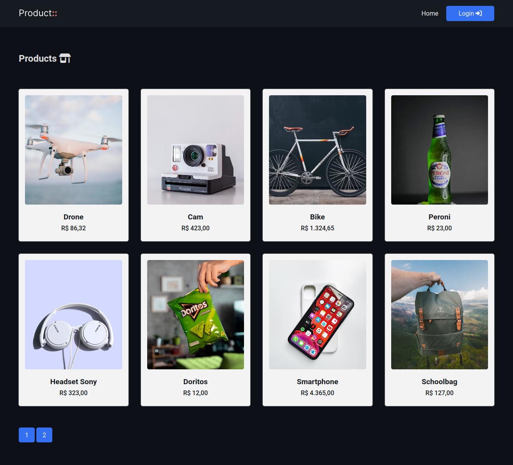
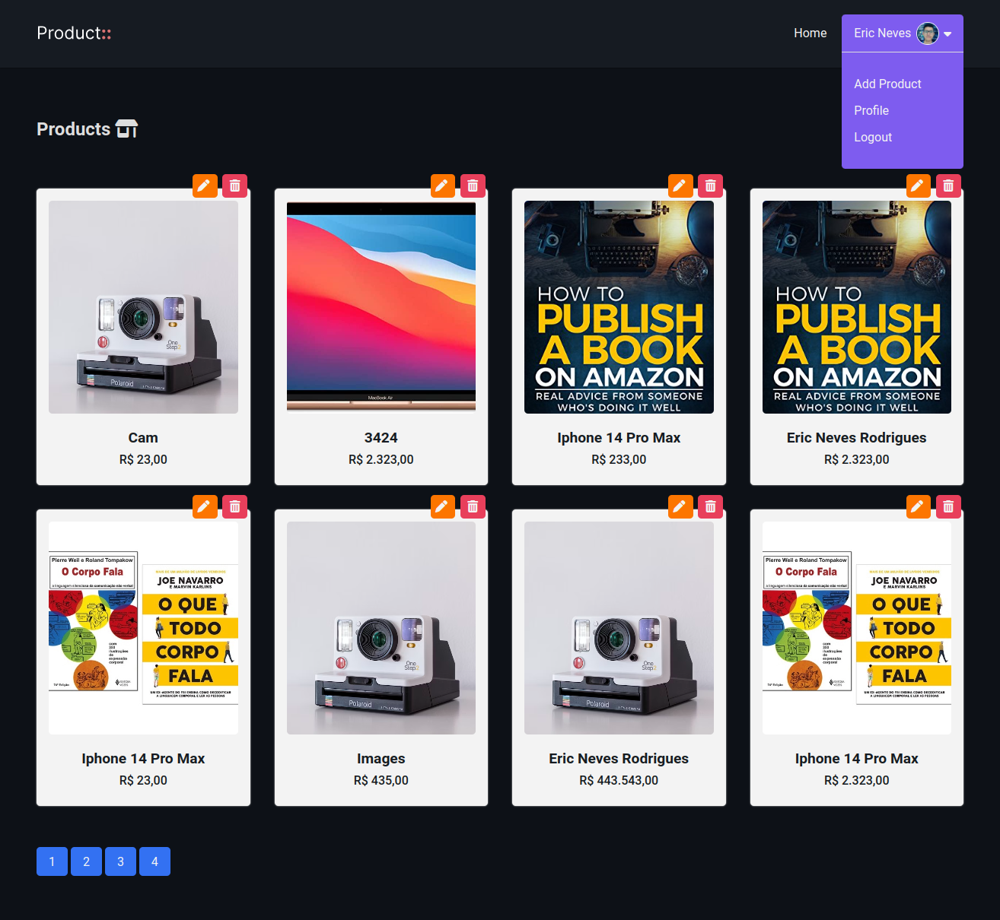

<h1 align="center">
  
  <br>
    Simple CRUD MVC
  <br>
</h1>

<h4 align="center">
  Um CRUD de produtos com PHP, SQL, Ajax, Autenticação, Paginação, OOP e arquitetura MVC.
</h4>

<p align="center">
  
  
  
</p>

<p align="center">
  <a href="">Features</a> •
  <a href="">How to User</a>
</p>




### Features 

A aplicação explora diversos recursos, como autenticação, permitir ações apenas ao usuário autenticado, rotas dinâmicas, segurança nas rotas, paginação, requisiçoes assíncronas e muito mais.

* PHP
  - PDO (SQL)
  - OOP
  - SPL - Autoload
* Javascript
  - Fetch API (Async)
  - Nullish Operator
  - Dropdown
  - Responsive Menu
* HTML/CSS

### How to use

Segue-se alguns passos para a execução da aplicação:

- Iniciar o servidor <b>Apache</b> e o <b>Mysql</b>.
- Copie a pasta do projeto para dentro do servidor <b>Apache</b>.
- Ativar o ModRewrite: <b>comando via terminal</b>: ```a2enmod rewrite``` ou habilitar nas configurações do <b>Apache</b>.
- Executar os comandos <b>DDL</b> e <b>DML</b> do arquivo <b>database.sql</b> que se encontra na raiz do projeto.


