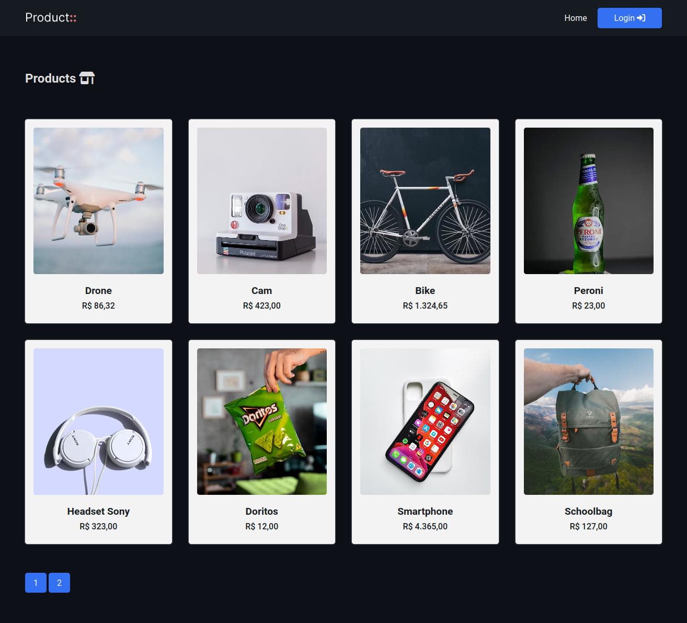
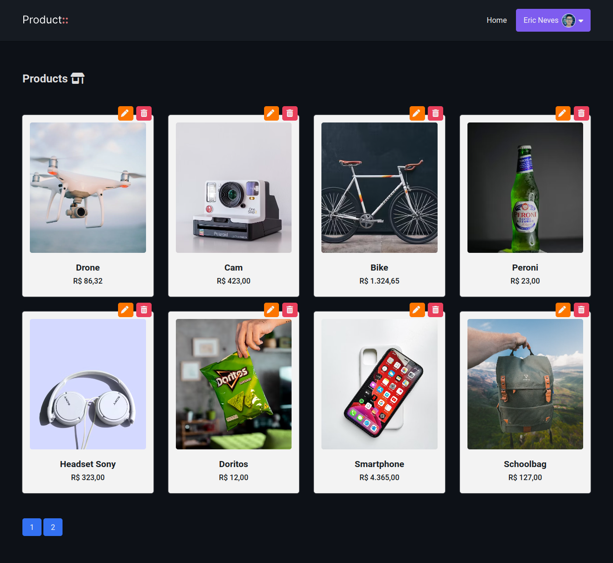

<h1 align="center">
  
  <br>
    Simple CRUD MVC
  <br>
</h1>

<h4 align="center">
  Um CRUD de produtos com PHP, SQL, Ajax, Autenticação, Paginação, OOP e arquitetura MVC.
</h4>

<p align="center">
  
  
  
</p>

<p align="center">
  <a href="#features">Features</a> •
  <a href="#how-to-use">How to User ?</a>
</p>




Website: [SimpleCRUDMVC](https://simplecrudmvc.000webhostapp.com/)

### Features

A aplicação explora diversos recursos, como autenticação, permitir ações apenas ao usuário autenticado, rotas dinâmicas, segurança nas rotas, paginação, requisições assíncronas e muito mais.

* PHP
  - <b>PDO (SQL)</b>
  - <b>OOP</b>
  - <b>SPL - Autoload</b>
* SQL
  - <b>DDL / DML</b>
* Javascript
  - <b>Fetch API (Async)</b>
  - <b>Nullish Operator</b>
  - <b>Dropdown</b>
  - <b>Responsive Menu</b>
* HTML/CSS

### How to use

Segue-se alguns passos para a execução da aplicação:

- Iniciar o servidor <b>Apache</b> e o <b>Mysql</b>.
- Configure o arquivo config.php com suas credenciais de banco de dados e edite o BASE_URL conforme a necessidade.
- Copie a pasta do projeto para dentro do servidor <b>Apache</b>.
- Ativar o ModRewrite: <b>comando via terminal</b>: ```a2enmod rewrite``` ou habilitar nas configurações do <b>Apache</b>.
- Executar os comandos <b>DDL</b> e <b>DML</b> do arquivo <b>database.sql</b>, o arquivo se encontra na raiz do projeto.


```sh

#Credenciais para acesso

$ email: ericneves@email.com
$ senha: admin

```

### License 📃


---

### Author 🧑‍💻
><a href="https://www.instagram.com/ericneves_dev/"></a> <a href="https://linkedin.com/in/ericnevesrr"> </a>
